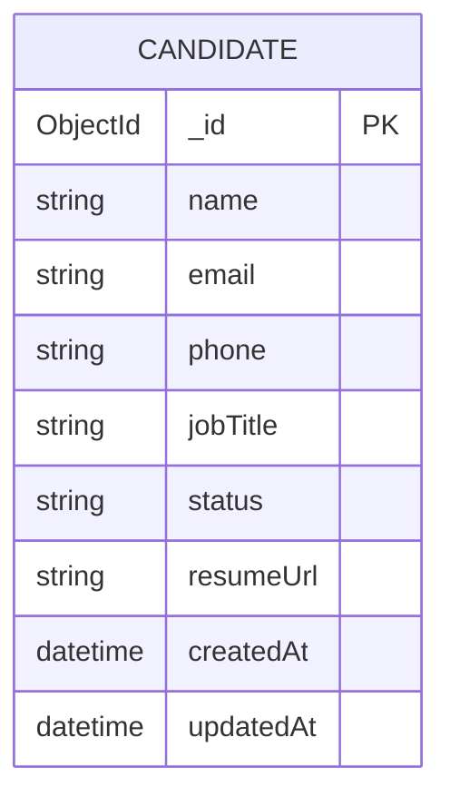

# Entity Relationship Diagram (ERD)

## 📊 Database Schema

The system uses MongoDB (NoSQL) to store candidate data. The schema is designed for quick access and efficient status tracking.

### Entity: Candidate

| Attribute | Type | Description |
|-----------|------|-------------|
| `_id` | ObjectId | Primary Key (Auto-generated) |
| `name` | String | Full name of the candidate |
| `email` | String | Unique email address |
| `phone` | String | 10-digit Indian phone number |
| `jobTitle` | String | Position for which the candidate is referred |
| `status` | String | Current pipeline stage (Pending, Reviewed, Hired) |
| `resumeUrl` | String | Local path or Cloud URL to the uploaded PDF |
| `createdAt` | Date | Timestamp of record creation |
| `updatedAt` | Date | Timestamp of last modification |

## 🧬 Mermaid Diagram

## 📝 Relationship Explanation

Currently, the system is designed as a standalone **Candidate** entity tracking system. 

- **Status Field**: Acts as the state-machine transition indicator for the candidate through the HR process.
- **Resume Linking**: The `resumeUrl` links the database record to the physical file stored in the `backend/uploads/` directory on the server.