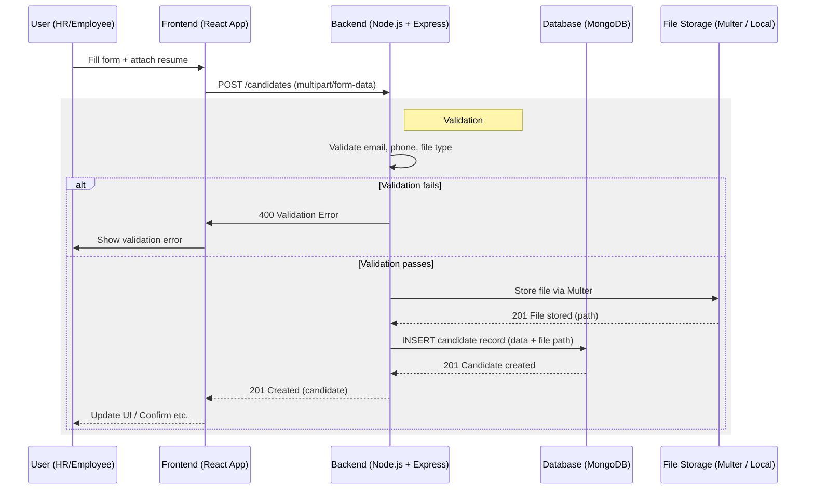
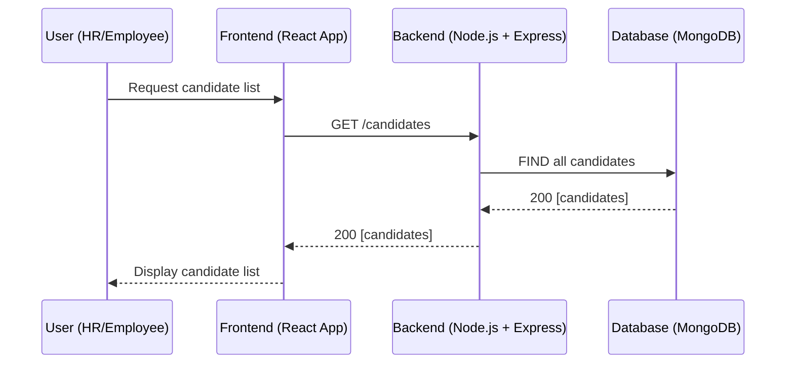
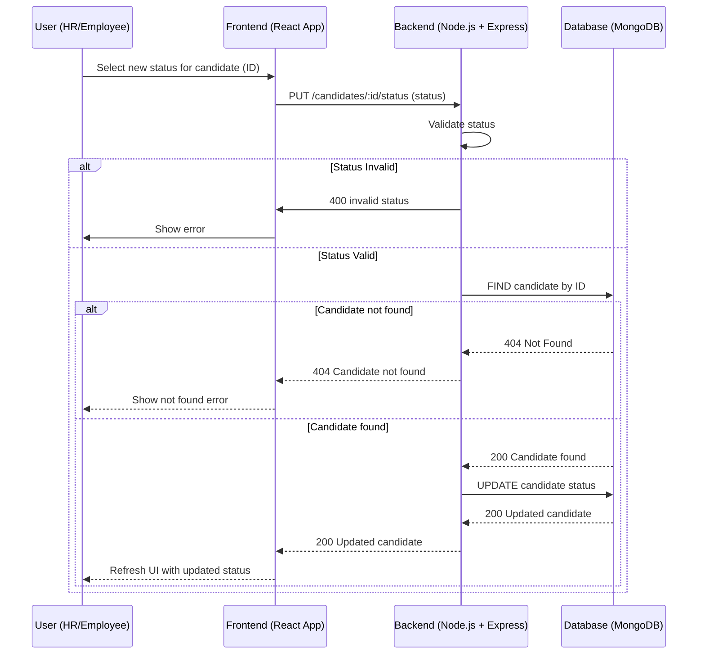
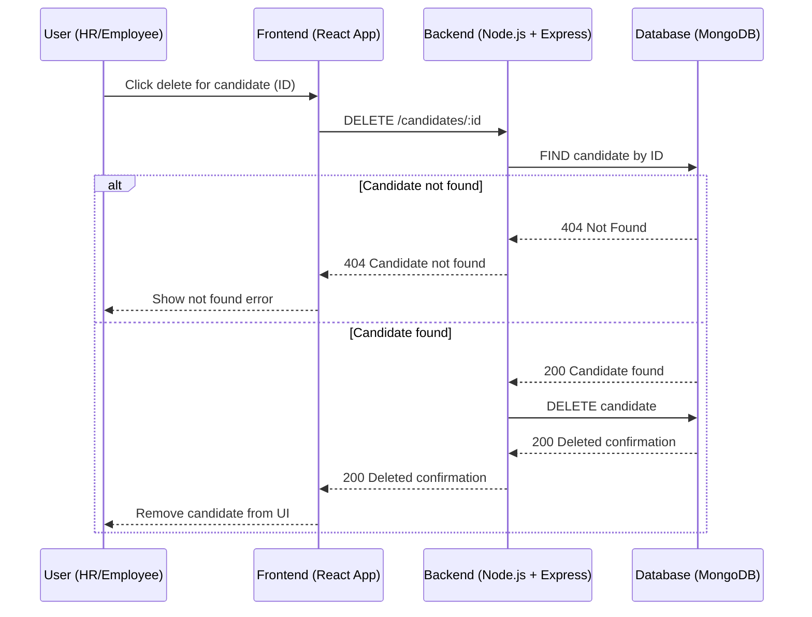

# Sequence Diagrams

The following diagrams illustrate the core workflows of the Candidate Referral Management System, matching the technical implementation and visual diagrams.

## ➕ Add Candidate Workflow

## 📋 Get Candidates Workflow

## 🔄 Status Update Workflow

## 🗑 Candidate Deletion Workflow

